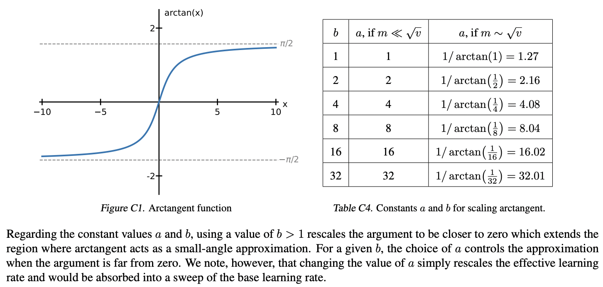

</img>

## Adam-atan2 - Pytorch

Implementation of the proposed <a href="https://arxiv.org/abs/2407.05872">Adam-atan2</a> optimizer in Pytorch

A multi-million dollar paper out of google deepmind proposes a small change to Adam update rule (using `atan2`) to remove the epsilon altogether for numerical stability and scale invariance

## Install

```bash
$ pip install adam-atan2-pytorch
```

## Usage

```python
# toy model

import torch
from torch import nn

model = nn.Linear(10, 1)

# import AdamAtan2 and instantiate with parameters

from adam_atan2_pytorch import AdamAtan2

opt = AdamAtan2(model.parameters(), lr = 1e-4)

# forward and backwards

for _ in range(100):
  loss = model(torch.randn(10))
  loss.backward()

  # optimizer step

  opt.step()
  opt.zero_grad()

```

## Todo

 - [ ] foreach version

## Citations

```bibtex
@inproceedings{Everett2024ScalingEA,
    title   = {Scaling Exponents Across Parameterizations and Optimizers},
    author  = {Katie Everett and Lechao Xiao and Mitchell Wortsman and Alex Alemi and Roman Novak and Peter J. Liu and Izzeddin Gur and Jascha Narain Sohl-Dickstein and Leslie Pack Kaelbling and Jaehoon Lee and Jeffrey Pennington},
    year    = {2024},
    url     = {https://api.semanticscholar.org/CorpusID:271051056}
}
```
